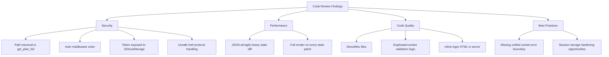

# Code Review Report - CursorRemote

## Scope

Review toàn repo theo 4 trục:

- Code Quality (DRY, độ phức tạp, maintainability)
- Security (rò rỉ dữ liệu, kiểm soát truy cập, injection/XSS)
- Performance (điểm nghẽn CPU/render/network)
- Best Practices (TypeScript/Node.js/Express)

## Kết luận nhanh

- **CRITICAL:** 0
- **HIGH:** 2
- **MEDIUM:** 4
- **LOW:** 4
- **Khuyến nghị:** **REQUEST CHANGES** trước khi production hardening.

## Findings theo mức độ nghiêm trọng

### HIGH

1) **Path Traversal khi đọc plan file**
- **Vị trí:** `src/server/relay.ts` (`command:get_plan_full`) -> `src/server/plan-files.ts` (`readPlanFile`)
- **Bằng chứng:** `planLabel` từ socket payload được truyền trực tiếp vào `resolve(homedir(), '.cursor', 'plans', label)` mà không whitelist/normalize boundary check.
- **Rủi ro:** Client đã authenticated có thể gửi `../` để đọc file ngoài thư mục plan.
- **Khuyến nghị fix:**
  - Chỉ cho phép pattern an toàn, ví dụ `^[a-zA-Z0-9._-]+$` (hoặc bắt buộc đuôi `.md`).
  - Dùng `path.resolve(baseDir, label)` và kiểm tra path kết quả phải bắt đầu bằng `baseDir`.
  - Trả lỗi khi fail validation.

2) **HTTP auth middleware đặt quá muộn, làm giảm hiệu lực bảo vệ route**
- **Vị trí:** `src/server/relay.ts` trong `setupRoutes()`
- **Bằng chứng:** Các route `/health`, `/`, static assets được khai báo trước `this.app.use(authMiddleware)`.
- **Rủi ro:** Trong chế độ password-protected, endpoint metadata vẫn có thể bị truy cập mà chưa qua auth middleware chung.
- **Khuyến nghị fix:**
  - Đưa auth middleware lên sớm hơn.
  - Explicit allowlist cho route public (`/login`, `/api/login`, có thể thêm asset login nếu cần).
  - Với `/health`, chỉ trả payload tối thiểu cho unauthenticated request.

### MEDIUM

3) **Session token bị expose cho JavaScript (giảm lợi ích HttpOnly cookie)**
- **Vị trí:** `src/server/relay.ts` (`POST /api/login` trả `{ token }`), `src/client/app.js` (`localStorage` + `Authorization`)
- **Rủi ro:** Nếu xảy ra XSS, token trong `localStorage` có thể bị đánh cắp.
- **Khuyến nghị fix:**
  - Chuyển sang cookie-only session cho web app.
  - Không trả token body cho browser flow.
  - Loại bỏ lưu token trong `localStorage`.

4) **Sanitizer chưa chặn protocol độc hại trong link**
- **Vị trí:** `src/client/app.js` (`sanitizeHtml`)
- **Bằng chứng:** Có strip `on*` attributes/script tags, nhưng không lọc `href="javascript:..."`/`data:...`.
- **Rủi ro:** Click-based XSS/phishing vector.
- **Khuyến nghị fix:** Chỉ cho phép `http:`, `https:`, `mailto:` (hoặc relative path), còn lại remove `href`.

5) **So sánh state bằng `JSON.stringify` lặp lại trên object lớn**
- **Vị trí:** `src/server/state-manager.ts` (`diff()` và `updateWindows()`)
- **Rủi ro:** CPU overhead tăng theo số lượng message/pending approvals trong polling loop.
- **Khuyến nghị fix:**
  - So sánh theo version/hash incremental.
  - Dùng key-based diff (ids/timestamps) cho collections lớn.

6) **Web client render full UI cho mỗi patch**
- **Vị trí:** `src/client/app.js` (`renderAll()` gọi lại nhiều section mỗi `state:patch`)
- **Rủi ro:** Re-render không chọn lọc gây lag trên phiên chat dài/thiết bị yếu.
- **Khuyến nghị fix:** Render theo patch key (selective rendering), tránh gọi toàn bộ pipeline mỗi lần.

### LOW

7) **File quá lớn, khó bảo trì**
- **Vị trí:** `src/server/dom-extractor.ts`, `src/client/app.js`
- **Rủi ro:** Tăng regression risk, khó test đơn vị và review diff.
- **Khuyến nghị fix:** Tách module theo domain (extractors theo widget type, UI render theo feature).

8) **Lặp validate + emit error pattern ở socket handlers**
- **Vị trí:** `src/server/relay.ts`
- **Rủi ro:** DRY thấp, tăng khả năng lệch hành vi khi thêm command mới.
- **Khuyến nghị fix:** Tạo helper chung cho validation + standardized command result.

9) **Login HTML inline string lớn trong server**
- **Vị trí:** `src/server/relay.ts` (`LOGIN_PAGE_HTML`)
- **Rủi ro:** Khó maintain, khó reuse style/script, khó test.
- **Khuyến nghị fix:** Tách thành template/static file riêng.

10) **Session persistence lưu token dạng plaintext trên disk**
- **Vị trí:** `src/server/webapp-sessions.ts`
- **Rủi ro:** Nếu máy bị đọc local files, attacker có thể reuse token.
- **Khuyến nghị fix:** Giảm TTL session, rotate token thường xuyên; cân nhắc lưu hash/token metadata thay vì token raw.

## Best Practices (TypeScript/Node.js) - Đánh giá

- **Điểm tốt**
  - Có tách lớp rõ trong backend (`Bridge`, `Extractor`, `StateManager`, `Executor`, `Relay`).
  - Type models dùng khá nhất quán trong server.
  - Có rate limit login và `timingSafeEqual` cho password compare.

- **Cần cải thiện**
  - Chưa chuẩn hóa error boundary cho toàn bộ socket handlers.
  - Một số logic xử lý đang monolithic, gây khó mở rộng.
  - Security posture giữa cookie auth và bearer/localStorage đang không nhất quán.

## Mermaid - Bản đồ điểm nghẽn/rủi ro

## Ưu tiên remediation (gợi ý)

1. Chặn path traversal cho plan files (HIGH)  
2. Sửa thứ tự/chiến lược auth middleware cho HTTP routes (HIGH)  
3. Chuyển cookie-only session và harden sanitizer links (MEDIUM)  
4. Tối ưu diff/render pipeline (MEDIUM)  
5. Refactor các file lớn và chuẩn hóa socket handler utilities (LOW->MEDIUM impact dài hạn)
