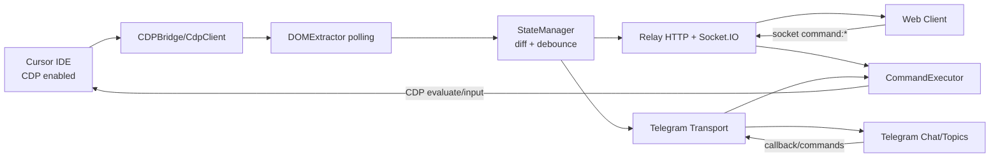

# New Member Overview - CursorRemote

## Repo này làm gì?

`CursorRemote` cho phép bạn theo dõi và điều khiển Cursor AI Agent từ xa (web mobile hoặc Telegram) trong lúc Cursor chạy trên máy local.

- Kết nối Cursor qua CDP (`--remote-debugging-port=9222`)
- Trích xuất trạng thái hội thoại/approval từ DOM Cursor
- Broadcast trạng thái realtime ra web client + Telegram
- Nhận lệnh từ xa (approve/reject/run/skip/send prompt/switch mode/model/tab/window) và thực thi ngược lại trên Cursor

## Cấu trúc thư mục quan trọng

- `src/server/`  
  Backend lõi của hệ thống.
  - `index.ts`: entrypoint, wiring toàn bộ service
  - `relay.ts`: HTTP + Socket.IO server, auth, route `/health`, `/api/login`, socket command handlers
  - `cdp-bridge.ts` + `cdp-client.ts`: kết nối/duy trì session CDP tới Cursor
  - `dom-extractor.ts`: parse DOM Cursor thành `CursorState`
  - `state-manager.ts`: diff + debounce + emit patch state
  - `command-executor.ts`: thực thi command từ remote client lên Cursor
  - `window-monitor.ts`: theo dõi nhiều cửa sổ Cursor song song
  - `transports/telegram*/`: tích hợp Telegram (sync, command, queue, formatter)

- `src/client/`  
  Web app (vanilla JS).
  - `index.html`, `app.js`, `styles.css`

- `extension/`  
  VS Code/Cursor extension (UI sidebar + lifecycle server + setup/license).

- `docs/`  
  PRD, architecture, setup guide, telegram docs.

- `tests/` + `fixtures/`  
  Unit/integration-style tests và fixture recordings.

## Luồng dữ liệu chính (endpoint -> logic xử lý)

### 1) Kết nối và stream trạng thái

1. Server start tại `src/server/index.ts`
2. `CDPBridge` kết nối Cursor CDP
3. `DOMExtractor` poll DOM và tạo state cấu trúc
4. `StateManager` tạo patch (diff + debounce)
5. `Relay` phát `state:patch` qua Socket.IO tới web client
6. Telegram transport nhận cùng state để update topic/message

### 2) Luồng API HTTP chính

- `POST /api/login` (`relay.ts`)  
  Xác thực password web app, tạo session token/cookie.
- `GET /health` (`relay.ts`)  
  Health check + trạng thái kết nối.
- `GET /` và static assets (`relay.ts`)  
  Serve web client.

### 3) Luồng command realtime (Socket.IO)

Client gửi các event như:
- `command:send_message`
- `command:approve`, `command:reject`, `command:approve_all`
- `command:switch_tab`, `command:new_chat`
- `command:set_mode`, `command:set_model`
- `command:switch_window`

`relay.ts` nhận event -> gọi `CommandExecutor` -> thực thi thao tác CDP lên Cursor -> state mới lại được extractor/state-manager phát ngược về client.

## Công nghệ, framework, thư viện cốt lõi

- Ngôn ngữ/chạy runtime:
  - `TypeScript`, `Node.js`, ESM
- Backend/realtime:
  - `express`, `socket.io`, `ws`
- Telegram:
  - `grammy`, `@grammyjs/auto-retry` (và raw transport)
- Frontend:
  - Vanilla JS + HTML/CSS (không dùng React/Vue)
- Extension/tooling:
  - VS Code Extension API, `esbuild`, `@vscode/vsce`
- Testing/dev:
  - `node:test`, `jsdom`, `tsx`

## Mermaid - luồng hoạt động tổng thể

## Gợi ý đọc code cho người mới (thứ tự)

1. `README.md` (bức tranh tổng quan + setup)
2. `src/server/index.ts` (cách hệ thống được ghép)
3. `src/server/relay.ts` (API + socket contract)
4. `src/server/types.ts` (domain model)
5. `src/server/dom-extractor.ts` + `command-executor.ts` (logic hai chiều state/command)
