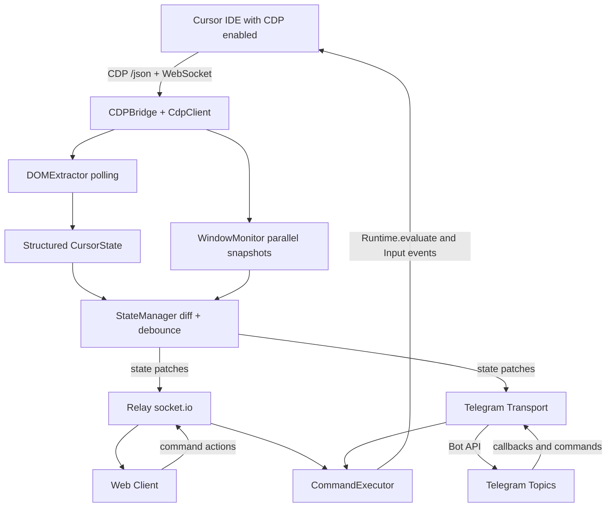

# OVERVIEW

## Mục đích dự án

`CursorRemote` là hệ thống relay cho phép theo dõi và điều khiển Cursor Agent từ xa qua trình duyệt web hoặc Telegram. Hệ thống kết nối tới Cursor đang chạy cục bộ bằng CDP (Chrome DevTools Protocol), trích xuất trạng thái hội thoại/approval từ DOM, phát realtime ra client, và nhận lệnh ngược lại để thao tác lên Cursor.

## 1) Góc nhìn Kiến trúc sư phần mềm

### Kiến trúc tổng thể

- Mô hình 3 lớp:
  - **Nguồn sự thật**: Cursor IDE (DOM chat panel + agent widgets)
  - **Lớp điều phối**: Relay Server (Node.js/TypeScript)
  - **Lớp hiển thị/điều khiển**: Web client + Telegram transport
- Relay server đóng vai trò trung tâm:
  - Kết nối CDP, polling trạng thái, phát patch state, nhận command, thực thi command.
- Thiết kế theo hướng **transport-agnostic**:
  - Cùng một state bus phục vụ nhiều kênh (web socket.io, Telegram bot).

### Pattern kiến trúc nổi bật

- **Event-driven**: `StateManager` phát thay đổi trạng thái (`state:patch`, `connection:changed`) cho các transport.
- **Adapter/Port nhẹ**:
  - CDP bridge/client tách riêng.
  - Transport web/telegram dùng abstraction chung.
- **Diff + debounce**:
  - Tránh bắn full state liên tục, giảm tải mạng và render phía client.
- **Parallel window monitoring**:
  - Theo dõi nhiều cửa sổ Cursor song song bằng các kết nối snapshot độc lập.

### Khả năng mở rộng

- **Scale theo số client**: phù hợp tốt cho nhiều web client cùng subscribe patch state.
- **Scale theo số cửa sổ Cursor**: có monitor song song, nhưng phụ thuộc hiệu năng CDP + extractor.
- **Mở rộng kênh giao tiếp**: dễ thêm transport mới (về mặt kiến trúc đã có abstraction).
- **Giới hạn hiện tại**:
  - Coupling mạnh vào DOM/selector của Cursor (dễ gãy khi UI đổi).
  - Một số file lõi quá lớn làm chậm vòng đời bảo trì/mở rộng.

## 2) Góc nhìn Lập trình viên

### Cấu trúc code chính

- `src/server/`: lõi backend (CDP, extraction, state, relay, command, telegram transports).
- `src/client/`: web client (vanilla JS, realtime UI).
- `extension/src/`: extension Cursor/VS Code (quản lý vòng đời server, setup, license, sidebar).
- `tests/`: test dựa fixture + jsdom.
- `docs/`: PRD và tài liệu kiến trúc/chức năng.

### Chi tiết triển khai đáng chú ý

- `src/server/index.ts`:
  - Composition root: ghép `CDPBridge`, `DOMExtractor`, `StateManager`, `CommandExecutor`, `Relay`, Telegram transports.
- `src/server/dom-extractor.ts`:
  - Trích xuất state từ DOM thành kiểu dữ liệu có cấu trúc (`CursorState`, plan widgets, run-command cards, approvals...).
- `src/server/state-manager.ts`:
  - Tính patch state, debounce, phát sự kiện cho transport.
- `src/server/command-executor.ts`:
  - Ánh xạ command từ client/telegram thành thao tác CDP (`Runtime.evaluate`, input/click/switch mode/model/tab...).
- `src/server/window-monitor.ts`:
  - Poll nhiều cửa sổ song song.

### Thư viện/chồng công nghệ

- Backend: `Node.js`, `TypeScript`, `Express`, `socket.io`, `ws`.
- Telegram: `grammy`, `@grammyjs/auto-retry` (+ raw bot API path).
- Test/Dev: `node:test`, `jsdom`, `tsx`, `esbuild`.
- Client web: không dùng framework (vanilla JS + HTML/CSS).

### Khả năng bảo trì

- **Điểm mạnh**:
  - Domain types rõ ràng.
  - Phân lớp module tương đối hợp lý theo trách nhiệm.
  - Có test cho các phần xử lý/hiển thị quan trọng.
- **Rủi ro**:
  - File lớn (`dom-extractor.ts`, `src/client/app.js`) mang nhiều responsibility.
  - Một số logic có thể trùng giữa extension và server (ví dụ license flow).
  - HTML inline dài trong server auth/render path làm giảm readability.

## 3) Góc nhìn Quản lý sản phẩm

### Mục tiêu sản phẩm

- Giảm "điểm nghẽn approval" khi dev rời máy.
- Cho phép giám sát và điều khiển agent từ mọi thiết bị (phone/tablet/web/Telegram).
- Giữ mô hình self-hosted (ưu tiên local network), không phụ thuộc cloud trung gian (ngoại trừ Telegram API).

### Tính năng chính

- Xem hội thoại agent realtime.
- Approve/Reject tool calls; Run/Skip/Allow command.
- Gửi prompt từ xa.
- Chuyển tab chat, mode, model.
- Theo dõi nhiều cửa sổ Cursor.
- Đồng bộ Telegram theo forum topic và hỗ trợ action trực tiếp.
- Extension panel cho setup, start/stop, health trạng thái.

### Luồng người dùng cốt lõi

- **Onboarding**: cài extension/standalone -> bật CDP (`--remote-debugging-port`) -> mở web client hoặc sync Telegram.
- **Daily flow**:
  - Agent chạy trên máy host.
  - Người dùng theo dõi từ xa.
  - Khi có yêu cầu approval hoặc run command, thao tác trực tiếp trên mobile/Telegram.
  - Hệ thống phản hồi gần realtime vào Cursor.

## Luồng hoạt động (Mermaid)

## Đánh giá nhanh

- Đây là codebase có định hướng sản phẩm rõ, kiến trúc thực dụng, và giá trị người dùng cao cho remote approval.
- Ưu tiên tiếp theo nên là:
  - Tách nhỏ `dom-extractor` và `app.js` theo module.
  - Chuẩn hóa contracts cho các interactive widgets.
  - Tăng test regression cho các selector phụ thuộc UI Cursor.
